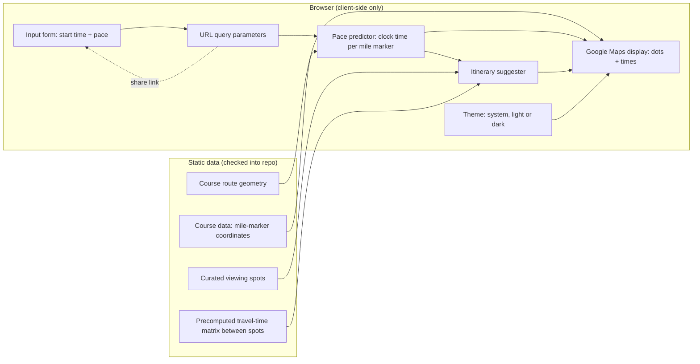

# High-Level Design: Marathon Spectator Planner

## Problem

Spectators at a marathon want to see a specific runner in person at multiple points along the course, but working out where and when to stand — and whether they can get from one spot to the next in time — is hard to do by hand from a course map and a rough pace guess. Today spectators either camp at one spot for the whole race or guess at a multi-spot plan and risk missing the runner because they misjudged travel time between viewing points.

## Approach

Given a runner's start time and average per-mile pace, compute the estimated clock time the runner passes each mile marker on the fixed Chicago Marathon course. Plot those estimated pass times as dots on an embedded Google Map, over a route line traced from the official course map so the drawn course follows the streets the runners actually run. From a curated set of spectator-friendly viewing points along the course, with precomputed travel times between them, suggest a small number of feasible viewing sequences — spots the spectator can reach before the runner arrives, in an order like "mile 3 → mile 7 → mile 10 → mile 14." The whole thing runs as static HTML/JS/data with no backend, so it can be hosted on GitHub Pages; inputs are also encoded into the page URL so a spectator can share a pre-filled link with friends.

## Target Users

- **Spectators** with no running or course expertise who want a concrete plan for watching one specific runner without missing them.
- **The runner, indirectly**, via a spectator who wants to share a pre-filled planning link (start time and pace already set) so friends and family don't have to redo the setup.

## Goals

- Given a start time and average pace, show the estimated clock time at each mile marker, accurate to the constant-pace assumption.
- Render those estimates as dots on a map, over a route line that follows the actual streets of the Chicago Marathon course rather than cutting between mile markers.
- Alongside the map, present the same predicted mile-marker times and suggested stops as a chronological list, so the plan is readable without interacting with map markers.
- Produce a short, ordered list of suggested viewing spots reachable in sequence, each with its expected travel/wait slack.
- Produce a shareable URL that reproduces the same plan for another viewer, with no server round-trip required.
- Render legibly in either a light or a dark color scheme, following the viewer's system preference unless they choose otherwise.
- Run entirely as static files servable from GitHub Pages — no backend, no build-time secrets required to view the page.

## Non-Goals

- Not a race-pacing tool for the runner's own use — this is a spectator-facing viewing planner.
- Not multi-runner: v1 tracks one start time and one pace per view.
- Not multi-race or multi-year generic: v1 is hard-scoped to the 2026 Bank of America Chicago Marathon course; supporting other races or years is future work.
- Not live-tracking: no integration with the runner's live GPS or bib-tracking feed. All estimates are computed from pace, not actual position.
- Not traffic-aware in real time: viewing-spot travel times are static, precomputed estimates, not live directions.

## Tenets

- **Static data over live API calls on the request-day critical path.** Marathon morning is exactly when spectator traffic peaks; leaning on live third-party API calls for the core recommendation logic risks quota exhaustion or rate-limiting at the worst possible time.
- **A plausible plan beats a precise one.** Pace varies mile to mile in reality; the tool is a planning aid built on a constant-pace assumption, not a guarantee. When a choice trades UI or computational complexity for marginal accuracy, favor simplicity.
- **Course geometry is read from the official map, never inferred.** Where the course physically runs is a published fact, not an estimate; a spectator standing on the wrong street has no plan at all. This is the one place the "plausible beats precise" tenet above does not reach — that tenet governs *predictions* (pace, travel times), which are estimates by nature, not the course's physical geometry, which is not.
- **The plan lives in the URL, not a server.** Any input that determines the plan — the runner's start time and pace — must be reproducible by another viewer from the link alone, with no accounts and no server-side session state. Display preferences are the deliberate exception: they belong to the person looking at the page, not to the plan, so they never travel in a shared link. A spectator who sends their plan to a friend is sending the plan, not their taste in color schemes.

## System Design

- **Course route geometry**: the traced path of the course itself — an ordered list of coordinates dense enough to follow the streets through every turn — extracted from the official course map and checked into the repo. Distinct from mile markers: geometry is what the route line is drawn from, mile markers are the labelled points along it.
- **Course data**: static dataset of mile-marker coordinates for the 2026 Chicago Marathon course, positioned by cumulative distance along the route geometry, checked into the repo.
- **Viewing spots**: a curated static list of spectator-accessible points along or near the course, not necessarily one per mile, each tied to a nearby mile marker.
- **Travel-time matrix**: static, precomputed (offline, one-time) walking and transit travel times between every pair of curated viewing spots.
- **Pace predictor**: a pure client-side function mapping start time, pace, and mile-marker distance to an estimated clock time at each marker.
- **Itinerary suggester**: a pure client-side function that, given predicted times at each viewing spot and the travel-time matrix, selects a feasible ordered sequence of spots — each reachable before the runner arrives, with slack.
- **Map display**: the Google Maps JavaScript API draws the route from the course route geometry and drops time-labeled dots at mile markers and suggested spots. This is the one live third-party dependency the page has, used only for rendering; it requires a client-side Maps API key restricted by HTTP referrer to the GitHub Pages domain. Below the map, the same predicted mile-marker times and itinerary stops are also rendered as a chronological text list, giving the spectator a scannable, non-map view of the identical plan.
- **Theme**: the page's color scheme, either following the viewer's operating-system preference or pinned to light or dark by a toggle. The choice is remembered on the viewer's own device rather than in the URL, because it describes the viewer and not the plan. Map display reads it too, so the embedded map is restyled to match rather than staying bright inside a dark page.
- **Share link**: the inputs that determine the plan (start time, pace) are serialized to URL query parameters. Loading the page with those parameters pre-populates the form and deterministically re-derives everything else.

## Key Design Decisions

| Decision | Alternatives considered | Why |
|---|---|---|
| Precompute the viewing-spot travel-time matrix offline and ship it as static data | Live Google Distance Matrix API calls at runtime; straight-line-distance heuristic | Live calls risk quota or rate-limit failures exactly when spectator traffic peaks on marathon morning. A straight-line heuristic is inaccurate in a dense urban course with lake, river, and rail barriers. A small, fixed, curated spot set makes one-time offline precomputation practical. |
| Hard-scope to the 2026 Chicago Marathon course only | A generic multi-race data model | No second race or year requirement exists yet; a generic model would be speculative design for a need that isn't present. |
| Carry the route as its own geometry dataset, separate from mile markers | Draw the route line by connecting the mile markers directly | Mile markers are a third of a mile apart, so a line through them cuts across city blocks, the Chicago River and Lincoln Park. Separating the two lets each be as dense as its own job needs. |
| Extract route geometry and mile-marker positions from the official course map PDF with a checked-in script | Transcribe coordinates by hand from the printed map; snap a coarse route to streets with a routing service | The official map is vector art, so the course path and its printed mile labels are exact data in the file rather than something to eyeball. A script is re-runnable against next year's map and its output is checkable against the map's own scale and mile labels; hand transcription is neither. A routing service infers a plausible route rather than reading the published one. |
| Single runner per view | Multi-runner tracking | Matches the described use case and keeps the share-link format and UI simple. |
| Remember the theme choice on the viewer's device, not in the URL | A `theme` query parameter alongside `start` and `pace`; no persistence at all | A theme in the URL would travel with a shared plan and override the recipient's own preference, and a preference that forgets itself on every reload is not a preference. The viewer's device is the only place a per-viewer choice belongs given there is no server. |
| A three-way theme choice — follow the system, or pin light or dark | A two-way light/dark toggle | Following the operating system is the right default and needs to remain reachable: a two-way toggle freezes the choice the moment it is touched, so a viewer who prefers to track their system's sunset switch can never get back to it. |
| Restyle the embedded map with the theme | Theme the page chrome only, leaving the map in its default palette | The map is the page's dominant element at 70% of viewport height; leaving it bright would make dark mode read as a bug rather than a theme. |
| Encode all inputs in the URL with no backend or session | A backend with saved plans or accounts | The project must be a fully static GitHub Pages site; URL-encoded state is the only shareable-state mechanism available without a server. |

## Success Metrics

- A spectator can go from a shared link to standing at their first viewing spot with correct expectations of when the runner will pass, without re-entering any inputs.
- The suggested itinerary's travel times leave enough slack that a spectator following it does not miss the runner at any suggested spot, under the constant-pace assumption.
- The page loads and functions — form, map, itinerary — as static files with no server-side component, verified by hosting on GitHub Pages.

## References

- `26-BACM-COURSE-MAP-PRINT.pdf` — official 2026 Bank of America Chicago Marathon course map; source for course route geometry and mile-marker positions.
