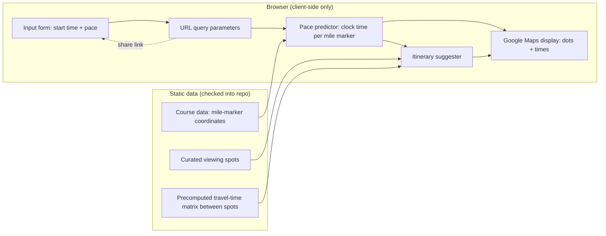

# High-Level Design: Marathon Spectator Planner

## Problem

Spectators at a marathon want to see a specific runner in person at multiple points along the course, but working out where and when to stand — and whether they can get from one spot to the next in time — is hard to do by hand from a course map and a rough pace guess. Today spectators either camp at one spot for the whole race or guess at a multi-spot plan and risk missing the runner because they misjudged travel time between viewing points.

## Approach

Given a runner's start time and average per-mile pace, compute the estimated clock time the runner passes each mile marker on the fixed Chicago Marathon course. Plot those estimated pass times as dots on an embedded Google Map. From a curated set of spectator-friendly viewing points along the course, with precomputed travel times between them, suggest a small number of feasible viewing sequences — spots the spectator can reach before the runner arrives, in an order like "mile 3 → mile 7 → mile 10 → mile 14." The whole thing runs as static HTML/JS/data with no backend, so it can be hosted on GitHub Pages; inputs are also encoded into the page URL so a spectator can share a pre-filled link with friends.

## Target Users

- **Spectators** with no running or course expertise who want a concrete plan for watching one specific runner without missing them.
- **The runner, indirectly**, via a spectator who wants to share a pre-filled planning link (start time and pace already set) so friends and family don't have to redo the setup.

## Goals

- Given a start time and average pace, show the estimated clock time at each mile marker, accurate to the constant-pace assumption.
- Render those estimates as dots on a map of the actual Chicago Marathon course.
- Alongside the map, present the same predicted mile-marker times and suggested stops as a chronological list, so the plan is readable without interacting with map markers.
- Produce a short, ordered list of suggested viewing spots reachable in sequence, each with its expected travel/wait slack.
- Produce a shareable URL that reproduces the same plan for another viewer, with no server round-trip required.
- Run entirely as static files servable from GitHub Pages — no backend, no build-time secrets required to view the page.

## Non-Goals

- Not a race-pacing tool for the runner's own use — this is a spectator-facing viewing planner.
- Not multi-runner: v1 tracks one start time and one pace per view.
- Not multi-race or multi-year generic: v1 is hard-scoped to the 2025 Bank of America Chicago Marathon course; supporting other races or years is future work.
- Not live-tracking: no integration with the runner's live GPS or bib-tracking feed. All estimates are computed from pace, not actual position.
- Not traffic-aware in real time: viewing-spot travel times are static, precomputed estimates, not live directions.

## Tenets

- **Static data over live API calls on the request-day critical path.** Marathon morning is exactly when spectator traffic peaks; leaning on live third-party API calls for the core recommendation logic risks quota exhaustion or rate-limiting at the worst possible time.
- **A plausible plan beats a precise one.** Pace varies mile to mile in reality; the tool is a planning aid built on a constant-pace assumption, not a guarantee. When a choice trades UI or computational complexity for marginal accuracy, favor simplicity.
- **Shareable state lives in the URL, not a server.** Any input a spectator can set must be reproducible by another viewer from the link alone — no accounts, no server-side session state.

## System Design

- **Course data**: static dataset of mile-marker coordinates for the 2025 Chicago Marathon course, curated from the official course map and checked into the repo.
- **Viewing spots**: a curated static list of spectator-accessible points along or near the course, not necessarily one per mile, each tied to a nearby mile marker.
- **Travel-time matrix**: static, precomputed (offline, one-time) walking and transit travel times between every pair of curated viewing spots.
- **Pace predictor**: a pure client-side function mapping start time, pace, and mile-marker distance to an estimated clock time at each marker.
- **Itinerary suggester**: a pure client-side function that, given predicted times at each viewing spot and the travel-time matrix, selects a feasible ordered sequence of spots — each reachable before the runner arrives, with slack.
- **Map display**: the Google Maps JavaScript API renders the course and drops time-labeled dots at mile markers and suggested spots. This is the one live third-party dependency the page has, used only for rendering; it requires a client-side Maps API key restricted by HTTP referrer to the GitHub Pages domain. Below the map, the same predicted mile-marker times and itinerary stops are also rendered as a chronological text list, giving the spectator a scannable, non-map view of the identical plan.
- **Share link**: all user inputs (start time, pace) are serialized to URL query parameters. Loading the page with those parameters pre-populates the form and deterministically re-derives everything else.

## Key Design Decisions

| Decision | Alternatives considered | Why |
|---|---|---|
| Precompute the viewing-spot travel-time matrix offline and ship it as static data | Live Google Distance Matrix API calls at runtime; straight-line-distance heuristic | Live calls risk quota or rate-limit failures exactly when spectator traffic peaks on marathon morning. A straight-line heuristic is inaccurate in a dense urban course with lake, river, and rail barriers. A small, fixed, curated spot set makes one-time offline precomputation practical. |
| Hard-scope to the 2025 Chicago Marathon course only | A generic multi-race data model | No second race or year requirement exists yet; a generic model would be speculative design for a need that isn't present. |
| Single runner per view | Multi-runner tracking | Matches the described use case and keeps the share-link format and UI simple. |
| Encode all inputs in the URL with no backend or session | A backend with saved plans or accounts | The project must be a fully static GitHub Pages site; URL-encoded state is the only shareable-state mechanism available without a server. |

## Success Metrics

- A spectator can go from a shared link to standing at their first viewing spot with correct expectations of when the runner will pass, without re-entering any inputs.
- The suggested itinerary's travel times leave enough slack that a spectator following it does not miss the runner at any suggested spot, under the constant-pace assumption.
- The page loads and functions — form, map, itinerary — as static files with no server-side component, verified by hosting on GitHub Pages.

## References

- `25-BACM-COURSE-MAP-1.pdf` — official 2025 Bank of America Chicago Marathon course map; source for mile-marker coordinates and course geometry.
